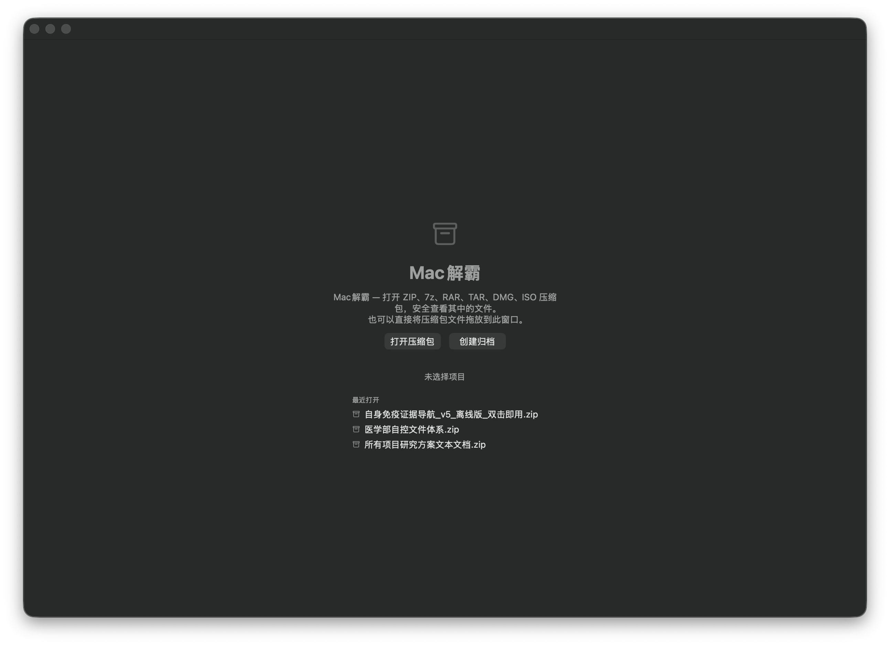
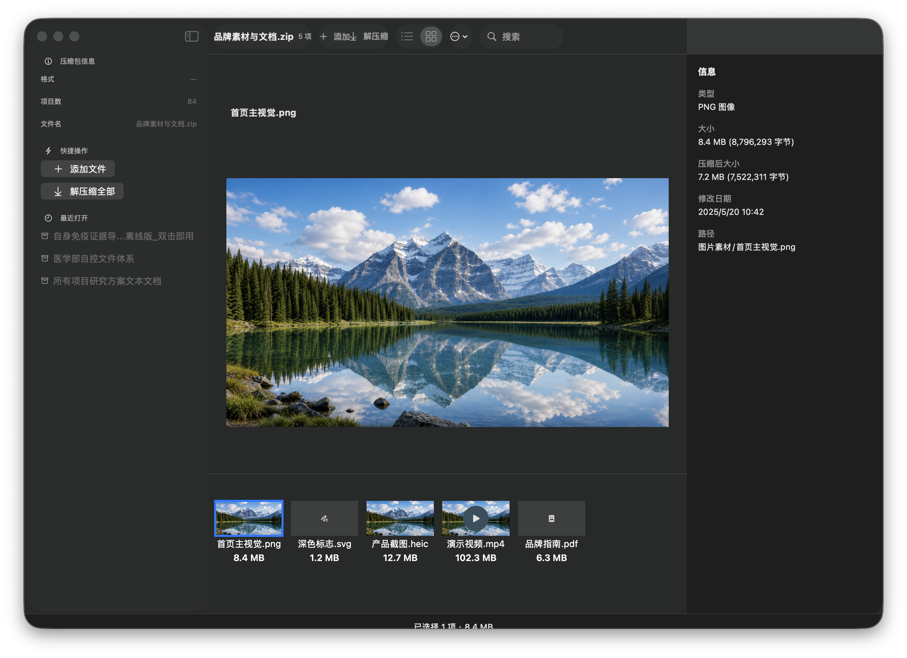
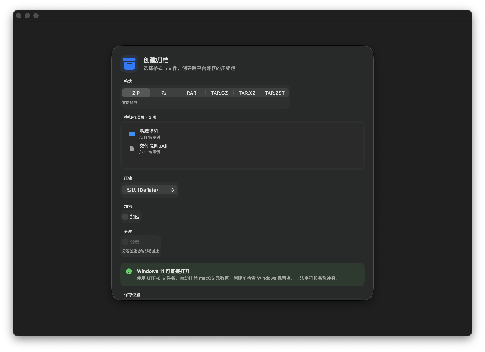

<p align="center">
  
</p>

<h1 align="center">🗜️ Mac Unzip <sub>Mac 解霸</sub></h1>

<p align="center">
  <strong>⚡ Blazing-fast. 🔒 Vault-grade security. 🍎 100% Native.</strong><br>
  <em>The archive utility your Mac deserved all along.</em>
</p>

<p align="center">
  <strong>English</strong> | <a href="README_zh.md">中文</a> | <a href="README_fr.md">Français</a> | <a href="README_es.md">Español</a> | <a href="README_it.md">Italiano</a> | <a href="README_ja.md">日本語</a> | <a href="README_ko.md">한국어</a>
</p>

<p align="center">
  
  
  
  
</p>

<p align="center">
  <a href="https://gerymk.qd.je/"><strong>🌐 Official Website</strong></a> &nbsp;•&nbsp;
  <a href="https://gerymk.qd.je/#pricing"><strong>🛒 Buy Pro — $1.99 / ¥9.99</strong></a> &nbsp;•&nbsp;
  <a href="https://gerymk.qd.je/"><strong>🔑 Activate License</strong></a>
</p>

<p align="center">
  <a href="#-screenshots">📸 Screenshots</a> &nbsp;•&nbsp;
  <a href="#-core-capabilities">🚀 Features</a> &nbsp;•&nbsp;
  <a href="#-security-architecture">🛡️ Security</a> &nbsp;•&nbsp;
  <a href="#-installation--building">⬇️ Install</a>
</p>

---

## ✨ Why Mac Unzip

**Your files deserve better than a wrapper.**

Most "Mac" archive tools aren't Mac apps at all. They're Electron shells burning 400 MB of RAM to display a file list. Or thin wrappers around a raw 7zip binary that treat security as an afterthought. One crafted archive, one symlink, one `../` in a filename, and your entire home directory is game over.

🍎 **Mac Unzip is different.** Built from the ground up in Swift 6.2 and SwiftUI. Zero wrappers. Zero runtimes. Zero telemetry. Zero network calls. Just pure, native, Apple Silicon performance doing exactly one thing exceptionally well: handling your archives safely at the speed of thought.

> 💡 *"We didn't optimize an Electron app. We wrote a Mac app."*

---

## 🚀 Core Capabilities

### 📂 Extraction — Open. Browse. Done.

- ⚡ **Instant open** — Drop an archive in, contents appear immediately. No "extracting…" spinner. No waiting.
- 🔐 **Password-protected ZIP** — AES-256 and ZipCrypto, handled natively
- 🪆 **Nested archive navigation** — Archives within archives? Double-click to drill down, back button to climb out
- 🎯 **Selective extraction** — Grab one file from a 10 GB archive without unpacking the rest
- ⏱️ **Real-time progress** — Live progress bar with instant cancellation for those "oops, wrong file" moments

### 📦 Creation — Six Formats. One Click.

- 🗜️ **ZIP / 7z / RAR / TAR.GZ / TAR.XZ / TAR.ZST** — Create them all
- 🔒 **AES-256 encryption** — Military-grade protection for sensitive payloads (ZIP / 7z)
- 🖱️ **Drag & drop** — Toss in files and folders; directory structure preserved recursively
- 📊 **Compression levels** — From "store" (instant) to "ultra" (maximum squeeze)
- ✅ **Preflight checks** — Path conflicts, illegal characters, Windows reserved names caught *before* creation begins
- 🪟 **Cross-platform ready** — UTF-8 filenames, macOS metadata auto-stripped, Windows 11 opens it natively

### 👁️ Preview — See It Before You Extract It

- 🖼️ **Images** (PNG / JPEG / HEIC / SVG / WebP) — Thumbnail grid + full-size render
- 📄 **PDF** — Embedded multi-page reader, right inside the archive browser
- 🎬 **Video** (MP4 / MOV) — In-app playback. No extraction to disk. No temp files. Just play.
- 💻 **Text / Code / Markdown** — Syntax-highlighted preview for 50+ languages
- 🔒 **Sandboxed** — Every preview runs in an isolated cache with size caps and path validation

### 🔄 Workflow — Built for How You Actually Work

- 🪟 **Multi-window** — Work with five archives side by side. Your Mac can handle it.
- 🖱️ **Finder integration** — Right-click → Compress / Open via macOS Services
- 🌗 **Dark / Light / System** — Three appearance modes, pixel-perfect in each
- 🔍 **Global search** — Find one file in an archive with 50,000 entries. Instantly.
- 💾 **Crash recovery** — Power outage mid-extraction? Resume where you left off. No orphans. No restarts.

---

## 📋 Format Support

| Operation | Formats |
|-----------|---------|
| 📂 **Open** | ZIP, 7z, RAR, TAR.GZ, TAR.XZ, TAR.ZST, DMG, ISO |
| 📦 **Create** | ZIP, 7z, RAR, TAR.GZ, TAR.XZ, TAR.ZST |
| 🔐 **Encrypt** | AES-256 (ZIP / 7z) |

---

## 🛡️ Security Architecture

**This isn't "add an if-statement and ship it" security.**

Every layer of the extraction pipeline is designed to handle *hostile* archives. The kind someone crafts specifically to break your machine. Mac Unzip doesn't flinch.

| 🧱 Defense Layer | ⚙️ Mechanism |
|---------------|-----------|
| 🚫 Path traversal | `ArchivePathPolicy` rejects `..`, absolute paths, control characters, empty components |
| 🔗 Symlink attacks | Full scan before extraction; any symlink aborts the entire operation |
| 📁 File descriptor safety | FD-relative operations throughout (`openat` / `mkdirat`) with `O_NOFOLLOW` + `O_EXCL` |
| 💣 Resource bombs | Four-dimensional budget: compression ratio, expanded size, entry count, directory depth |
| ⚛️ Atomic writes | Write to temp → `fsync` → atomic rename; automatic cleanup on failure |
| 🏗️ Process isolation | External tools (7zz / rar) invoked via explicit argv arrays. Shell injection: structurally impossible. |
| 📦 Preview sandbox | Isolated cache with size caps and path validation. Nothing escapes. |
| 🍎 Quarantine | Files from archives tagged with `com.apple.quarantine` for Gatekeeper evaluation |

> 🔒 *"We treat every archive as potentially hostile until proven otherwise."*

---

## 📸 Screenshots

### 🏠 Welcome

Drop an archive in and go. No onboarding. No account. No nonsense.



### 🌙 Archive Browsing (Dark Mode)

Full media preview, file details, quick actions — all in one view.



### ☀️ Archive Browsing (Light Mode)


### 📦 Create Archive

Pick a format. Set encryption. Add files. Done. Cross-platform compatibility checked automatically.



---

## 📖 Usage Guide

### 📂 Extracting Files

1. 🖱️ Drop an archive into the window (or File → Open)
2. 👀 Browse contents, select what you need
3. 📤 Click "Extract" in the toolbar, choose a destination
4. ✅ Done. Your files are in place.

### 📦 Creating Archives

1. ➕ Click "New Archive" on the welcome screen (or File → New)
2. 🗂️ Choose output format: ZIP / 7z / RAR / TAR.GZ / TAR.XZ / TAR.ZST
3. 🖱️ Drag in files and folders
4. 🔐 Optional: set a password, adjust compression level
5. 💾 Click "Create" and pick a save location

### 👁️ Previewing Files

Click any file in the archive browser:
- 🖼️ Images render at full resolution
- 📄 PDFs display inline with page navigation
- 🎬 Videos play in-app (no extraction needed)
- 💻 Code gets syntax highlighting

### 🪆 Nested Archives

Double-click a compressed file inside an archive to drill in. Hit the back button to climb out. Turtles all the way down. 🐢

---

## ⚔️ How It Compares

We're not here to trash other tools. These are different engineering choices with measurable consequences:

| Dimension | 🏚️ Typical Approach | 🏰 Mac Unzip |
|-----------|---------------------|--------------|
| Runtime | Electron / bundled Python / Node | Pure native Swift + SwiftUI |
| Memory (idle) | 200–400 MB 😱 | ~30–50 MB 😌 |
| Extraction safety | Minimal or no path validation | FD-relative ops + path policy + resource budgets (8 layers) |
| Symlinks | Extracted blindly → arbitrary overwrite | Full pre-scan; any symlink = full abort |
| External tools | Shell string interpolation | Explicit argv arrays. Injection impossible. |
| Preview | Extract to disk first, then open | Sandboxed streaming. Nothing touches your filesystem. |
| Crash recovery | Orphaned partial files. Start over. | Journaled extraction. Resume from interruption. |
| Telemetry / Ads | "Free" = you're the product | Zero telemetry. Zero ads. Zero network. Period. |
| Apple Silicon | Intel binary under Rosetta | Native arm64. Every M-series core utilized. |

---

## 💰 Get MacUnzip Pro

<p align="center">
  <a href="https://gerymk.qd.je/">
    
  </a>
  &nbsp;&nbsp;
  <a href="https://gerymk.qd.je/">
    
  </a>
</p>

**$1.99** one-time purchase (launch promo, normally $9.99). Lifetime license. No subscription. No upsell.

After purchase you receive a license key (`MACUNZIP-XXXX-XXXX-XXXX-XXXXX`). Enter it in **Settings → Activate**. Verification is 100% offline via Ed25519 signature. Zero phone-home.

---

## 🥊 MacUnzip vs. The Market

Free tools hit a ceiling. Paid tools charge too much. Here's the landscape:

| | 🏆 MacUnzip | The Unarchiver | Keka | BetterZip | WinZip Mac |
|---|---|---|---|---|---|
| **Price** | **$1.99** once | Free | Free / $3.99 | $35 | $29.99 |
| **In-app preview** | ✅ Full (video/PDF/code) | ❌ | ❌ | ⚠️ Limited | ⚠️ |
| **Create archives** | ✅ 6 formats | ❌ | ✅ | ✅ | ✅ |
| **AES-256 encrypt** | ✅ | ❌ | ✅ 7z only | ✅ | ✅ |
| **Security hardening** | ✅ 8-layer | ❌ | ❌ | ❌ | ❌ |
| **Crash recovery** | ✅ Journal | ❌ | ❌ | ❌ | ❌ |
| **CJK auto-detect** | ✅ | ⚠️ | ❌ | ❌ | ❌ |
| **Finder integration** | ✅ Right-click | ⚠️ | ⚠️ | ✅ | ⚠️ |
| **Offline license** | ✅ Ed25519 | N/A | N/A | ❌ Online | ❌ Online |
| **Native SwiftUI** | ✅ | ❌ | ❌ | ❌ | ❌ |
| **Telemetry** | Zero | Zero | Zero | Unknown | Yes |

> 💡 **The Unarchiver** can't create archives or preview files. **Keka**'s preview request has been "Future" on GitHub for 3+ years. **BetterZip** costs $35 with no security hardening. **WinZip** brings subscription fatigue and Windows DNA to your Mac.

---

## ⬇️ Installation & Building

### 🛠️ Build from Source

```bash
git clone https://github.com/smkzw/Mac-Unzip.git
cd Mac-Unzip/ArchiveWorkbench
xcodegen generate
open MacUnzip.xcodeproj
```

In Xcode 26: select the **App** scheme → target your Mac → press **⌘R**. That's it. You're running.

### 🔧 External Tool Dependencies (Optional)

| Tool | Purpose | Install |
|------|---------|---------|
| 7zz | 7z format support | `brew install 7zip` |
| rar | RAR creation | Download from RARLAB |

Not installed? No problem. The format gracefully disables itself with a clear message. Everything else keeps working. 🤷

---

## 💻 System Requirements

| Requirement | Minimum |
|-------------|---------|
| 🖥️ OS | macOS 26 |
| ⚙️ Chip | Apple Silicon (M1 or later) |
| 🔨 Build tools | Xcode 26 |
| 💾 Disk space | ~50 MB (app binary) |

---

## 📜 License

| Tier | What you get | Price |
|------|-------------|-------|
| 🆓 **Free** | Extract ZIP/TAR/GZ, open & browse archives, format detection | $0 |
| 👑 **Pro** | Extract, create, encrypt, preview, nested browsing, Finder integration, crash recovery | [$1.99 →](https://gerymk.qd.je/) |

Pro is a one-time purchase. Lifetime. One device. Offline Ed25519 verification. See [LICENSE](LICENSE) for full terms.

---

## 🤝 Contributing & Feedback

- 🐛 Found a bug? → [File an Issue](https://github.com/smkzw/Mac-Unzip/issues)
- 💡 Have an idea? → Open a Pull Request
- 🔓 Security vulnerability? → Report privately via GitHub Security Advisory

---

<p align="center">
  <strong>🗜️ Mac Unzip</strong><br>
  <em>Compression, the native way. ⚡</em><br><br>
  <sub>Built with ❤️ for Apple Silicon. No Electron was harmed (or used) in the making of this app.</sub>
</p>
