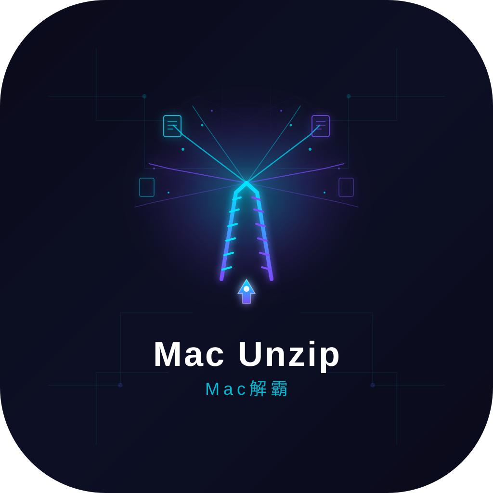

# Mac Unzip

> **あらゆるアーカイブを解き放て。圧縮を、思いのままに。**
> ネイティブ Swift で鍛え上げた、モダン Mac のためのサイバーパンク級 解凍エンジン。

[English](README.md) | [中文](README_zh.md) | [Français](README_fr.md) | [Español](README_es.md) | [Italiano](README_it.md) | **[日本語](README_ja.md)** | [한국어](README_ko.md)

---

**Mac Unzip** は、**Swift 6.2** と **SwiftUI** でゼロから構築されたネイティブ macOS アーカイブユーティリティです。**Apple Silicon** に最適化され、ZIP・7z・RAR・TAR・DMG・ISO など主要なあらゆるフォーマットの展開・作成・保護を、信頼できるあなたの Mac の中で完結させます。

Electron 不使用。外部ランタイムの同梱なし。テレメトリもなし。ただ一つのことを、驚くほど的確にこなす、高速で無駄のないツールです。

## 機能

### 対応フォーマット
- **展開：** ZIP、7z、RAR、TAR.GZ、TAR.XZ、TAR.ZST、DMG、ISO
- **作成：** ZIP、7z、RAR、TAR.GZ、TAR.XZ、TAR.ZST
- **暗号化：** ZIP と 7z に AES-256 暗号化を適用

### ワークフロー
- **ドラッグ＆ドロップ** — ウィンドウのどこへでもアーカイブを落とすだけで展開・プレビュー
- **Finder 同期拡張** — ファイルやフォルダを右クリックして圧縮・展開
- **アプリ内プレビュー** — 画像、PDF、動画、テキスト、Markdown を展開せずに確認可能
- **マルチウィンドウ対応** — 複数のアーカイブを同時に扱えます
- **ダーク／ライトモード** — システムの外観に自動追従

### セキュリティと信頼性
- **安全な展開** — zip-slip（パストラバーサル）攻撃を防御
- **シンボリックリンクの拒否**とリソース上限により、悪意あるアーカイブを未然に阻止
- **クラッシュリカバリジャーナル** — 中断された展開は破損せず、再開可能
- **AES-256 暗号化** — 機密性の高い ZIP・7z を保護

## スクリーンショット



## インストール

### 必要条件
- **macOS 26** 以降
- **Apple Silicon**（M シリーズ）搭載 Mac
- ソースからのビルドには **Xcode 26**

### ソースからビルド

```bash
git clone https://github.com/smkzw/Mac-Unzip.git
cd ArchiveWorkbench
xcodegen generate
open MacUnzip.xcodeproj
```

Xcode 26 で **App** スキームを選択し、ターゲットデバイスを指定して **⌘R** を押してください。

リポジトリのルートには、すぐに試せるビルド済み `MacUnzip-1.0.7.dmg` も用意しています。

## システム要件

| 項目 | 最小要件 |
| --- | --- |
| オペレーティングシステム | macOS 26 |
| アーキテクチャ | Apple Silicon（arm64） |
| ビルドツール | Xcode 26、Swift 6.2 |
| ディスク容量 | アプリ本体で約 150 MB |

## ライセンス

**個人利用は無料です。** 商用・企業利用には有償ライセンスが必要です。

- 個人利用、教育目的、非商用のオープンソース活動 — 無料
- 企業内利用、フリーランスの受託業務、商用製品への組み込みなど — [有償ライセンスが必要](LICENSE)

詳細は [LICENSE](LICENSE) ファイルをご確認ください。

---

© 2026 smkzw. All rights reserved.
