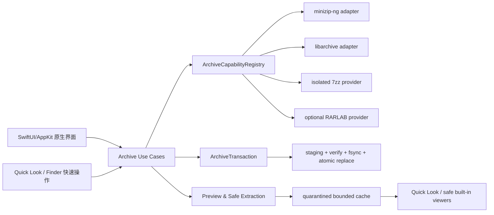

# Architecture Options for the Native macOS Archive App

Date: 2026-07-11
Status: commercial-grade capability options for user decision; not an approved design specification

## Confirmed installation boundary

The immediate artifact is an Apple Silicon application installed on the user's own Mac. Its module, dependency and build boundaries must also support a later website-distributed Developer ID/notarized build and a possible GitHub open-source edition. Mac App Store is excluded. No remote repository, upload, public DMG, website deployment or release is authorized until the user explicitly commands it.

“Commercial-grade” in this project means product-level frontend/backend capability, stability, security, performance, visual quality and complete user workflows. It does not require sales or store submission. Future direct/open-source distribution readiness is an architectural constraint, not a current release action.

RAR creation is supplied only by a separately installed and licensed RARLAB `rar` executable. The app discovers and validates that provider but never copies it into any local, website or open-source bundle.

## Build profiles that share one core

- `Local`: ad-hoc/local signing; may discover local `7zz` and RARLAB providers; used for current development and acceptance.
- `Direct`: future Developer ID, hardened runtime and notarized website build; may bundle a signed ARM64 7-Zip helper only after LGPL/source/notice compliance is complete; RARLAB remains external.
- `OpenSource`: future source distribution with reproducible dependency setup, SPDX/component manifest and no proprietary RAR binary; license choice remains a user decision. RAR creation activates only when the builder/user installs RARLAB separately.

These profiles change packaging and provider availability, never the archive domain model, Chinese UI semantics, transaction rules or compatibility contracts.

## Non-negotiable product invariants

- Native SwiftUI/AppKit application for the latest macOS, Apple Silicon only.
- Liquid Glass follows current macOS system hierarchy and materials; it is not a decorative blur layer.
- Chinese-first product wording grounded in current macOS Simplified Chinese strings, with complete localization architecture rather than hard-coded Chinese.
- Browse, search, preview, selective extraction and format-aware archive editing.
- No mutation writes directly over the only source archive. Single-file edits are staged, verified and atomically committed; multipart edits use verified `另存为…` publication because a file set cannot be replaced atomically.
- Windows compatibility is shown as receiver contracts, not one misleading badge.
- Format, encryption, mutation and recovery capabilities come from a runtime capability registry. The UI does not infer them from filename extensions.

## Option A — Capability-routed hybrid core

Engine route:

- minizip-ng: ZIP create/read/edit, ZipCrypto, WinZip AES, split archives and repair-oriented paths.
- libarchive: TAR family, GZIP/BZIP2/XZ/Zstandard, ISO and broad streaming read/write.
- isolated local ARM64 `7zz` helper: full 7z update/encryption and encrypted 7z/RAR extraction.
- public macOS disk-image mechanisms: DMG read-only browse/mount workflow.
- optional external RARLAB `rar`: RAR creation after provider/license/live-probe checks.

Strengths:

- Meets the approved format matrix, including local RAR creation.
- ZIP operations use a purpose-built library with encryption/edit capabilities; broad formats stay streaming; 7z uses its reference implementation.
- A codec failure remains behind a typed adapter and does not leak CLI concepts into the UI.

Costs/risks:

- Three engine families increase differential-test and dependency-audit burden.
- 7-Zip LGPL obligations matter whenever its binary is bundled. The Direct/OpenSource profiles need corresponding source, build information and notices appropriate to the final packaging; the Local profile may initially discover a separately installed `7zz`.
- Overlapping readers can disagree, so routing must be deterministic and differential checks must be explicit.

Assessment: recommended because it satisfies the full scope with the strongest per-format engines.

## Option B — Local helper-centric core

Engine route:

- `7zz` handles ZIP, 7z, TAR-family, RAR extraction and most archive updates through one isolated process boundary.
- RARLAB `rar` handles RAR creation.
- macOS mechanisms handle DMG.

Strengths:

- Smallest integration surface and fastest route to broad working coverage.
- One helper already supports the hardest encrypted 7z/RAR cases.

Costs/risks:

- Process startup, text-output parsing and helper-version coupling affect every common operation.
- Fine-grained streaming preview, progress, cancellation and structured errors are weaker.
- A single helper defect or output change impacts most formats; native library testability and UI responsiveness suffer.

Assessment: useful prototype/fallback route, but not the preferred product-quality architecture even for local use.

## Option C — In-process libraries first

Engine route:

- minizip-ng for ZIP.
- libarchive for all broad formats and basic 7z/RAR reads.
- RARLAB `rar` for RAR creation.
- no `7zz` helper.

Strengths:

- Best structured progress/cancellation and smallest external-process attack surface.
- Straightforward deterministic testing of ZIP and streaming formats.

Costs/risks:

- Cannot satisfy encrypted 7z creation/extraction or encrypted RAR extraction with the verified library capabilities.
- Succeeds only by reducing an already approved requirement.

Assessment: rejected as the final architecture; its library adapters remain part of Option A.

## Recommended domain architecture under Option A

### UI layer

- A stable Finder-native `NavigationSplitView` shell combines the user-selected visual directions 1 and 3: normal/mixed archives use a hierarchical list/outline with a right preview/inspector; image/video-dominant folders may recommend a large-preview mode with a bottom nearby-items strip. The user can switch modes manually, and a manual choice is remembered locally per archive/folder without modifying the archive.
- Window toolbar contains primary open/create/extract actions; glass is limited to system-supported bars, overlays and controls.
- Table/outline remains content-first and opaque enough for legibility, selection and large archives.
- Menu commands, keyboard shortcuts, drag-and-drop, undoable staged edits, VoiceOver and Full Keyboard Access are first-class.

### Use-case layer

Typed operations: open, inspect, search, preview, extract selected/all, create, add, remove, rename, replace, test integrity, repair where supported, convert and save-as. Each reports structured progress, cancellation, warnings and recovery state.

### Deterministic engine ownership

There is exactly one primary engine for each `(format, operation)` pair. The registry never picks an engine by trying them in an arbitrary order, and a mutation never changes engines halfway through a transaction.

| Format/operation | Primary | Allowed fallback |
|---|---|---|
| ZIP list/read/create/add/remove/rename/replace/encrypt/split | minizip-ng | Read-only diagnosis with libarchive; 7zz only for an explicitly unsupported compression/encryption method |
| 7z list/read/create/update/encrypt/split | 7zz provider | libarchive for unencrypted read-only diagnosis only |
| TAR/CPIO and GZIP/BZIP2/XZ/Zstandard streams | libarchive | 7zz read-only diagnosis where supported |
| RAR list/read/extract | 7zz provider | libarchive for supported unencrypted read-only cases |
| RAR create/update | external licensed RARLAB provider | none |
| ISO list/read/extract | libarchive | 7zz read-only diagnosis |
| DMG browse/mount | isolated macOS disk-image workflow | raw extraction only when a separately tested engine capability exists |

A fallback must return a structured reason such as `unsupportedMethod`, `encryptedUnsupported`, `damagedDirectory` or `providerUnavailable`. Corruption, wrong password and unsupported format are not interchangeable. Read-only fallback never silently enables edit/save. `ZIPFoundation` remains a source-quality reference, not a runtime engine.

### Transaction layer

Archive edits are a logical working set. Save performs free-space preflight, writes to a hidden sibling staging file on the destination volume, validates the entry manifest and engine integrity, fsyncs the staged file and parent directory, verifies the source identity/content fingerprint, then atomically replaces a single-file archive. Cancel or crash leaves the source untouched.

- Sibling staging is mandatory, not best effort. If the source directory is not writable, `保存` is disabled and `另存为…` uses staging beside the user-selected destination.
- The open snapshot records volume/device, file identity, size, nanosecond timestamps and SHA-256. Before commit, the app coordinates access and rechecks identity plus SHA-256. A mismatch stops the commit with `原压缩包已被其他应用更改`.
- Free-space estimation is advisory. `ENOSPC` at any write/fsync step aborts, preserves the source and offers cleanup/retry.
- Stage names follow `.ArchiveApp.<transaction-UUID>.staging`; an app-owned recovery journal contains only a security-scoped bookmark, source fingerprint, stage identity, operation and state. Startup never auto-commits: it offers `继续恢复` or `删除临时文件` after revalidation.
- Multipart outputs are a file set, so POSIX cannot atomically replace the whole set. Creating a split archive stages all parts in a sibling transaction directory, verifies the full set, then publishes it under a new basename. Editing an existing split archive always uses `另存为…`; it never claims in-place atomic save.
- ZIP usually uses entry-copy/rebuild operations provided by minizip-ng inside this transaction. 7z update is presented as `需要重新生成压缩包`; the UI shows estimated rewrite size, progress and safe cancellation before starting.

### Helper-provider lifecycle

Version 1 uses one short-lived helper process per operation, never a persistent shared pool. Every job gets a private `0700` working directory and a distinct output destination. The runner allows at most two concurrent helper jobs globally and exactly one mutation per archive identity.

- No shell; fixed executable identity; explicit argv; end-of-options protection; minimal environment; no inherited user aliases or working directory.
- The provider contract pins a tested version range and machine architecture. Unsupported versions are disabled with a diagnostic, never parsed optimistically.
- stdout/stderr are drained concurrently into bounded ring buffers. Overflow terminates the job with a structured diagnostic rather than deadlocking or silently truncating a success decision.
- Cancel sends graceful termination, waits a bounded interval, then escalates to forced termination. Only staged outputs are touched; the transaction layer removes or journals remnants.
- Helper exit status is insufficient on its own. Success requires expected structured/listing evidence plus an independent integrity test of the produced archive.

RARLAB discovery never trusts the first `PATH` match. A user selects or confirms the executable; the app resolves symlinks, verifies it is a regular Apple Silicon executable owned by the user/root and not group/world-writable, checks version/output identity, then runs a temporary create/test/extract probe. RAR creation stays disabled until every check passes and is disabled again when the identity changes.

### Security layer

- Prevent Zip Slip/path traversal, symlink escape, device-name collisions, decompression bombs and unbounded preview extraction.
- Never execute extracted content automatically.
- Helper runner uses no shell, explicit argv, `--` end-of-options, sanitized environment, bounded stdout/stderr, timeout/cancel and executable identity verification.
- Passwords use secure fields and optional Keychain storage; logs never contain passwords or full private paths.

Preview extraction has a stricter path than normal extraction. Each archive window owns a random `0700` cache root. Entry IDs map to random filenames with only a validated display extension; archive path components never form a filesystem path. Files are created with exclusive/no-follow semantics, canonical containment is checked before and after creation, symlinks/special files are rejected, quarantine is applied, and per-file/session byte, ratio and time budgets are enforced. The cache is deleted on window close and by a startup TTL sweep.

Nested archives never recurse automatically. Opening one creates an isolated child session only after user action; default depth, entry-count, expanded-byte and time budgets apply across the whole parent/child chain.

DMG is a separate provider: attach read-only, no-auto-open and no-browse; consume machine-readable output; record the exact mount identity; never run mounted content; detach on close and recover stale app-owned mounts at next startup. A failed detach is visible and retryable.

### Localization and filename layer

- String Catalogs with grammatical/context notes and layout tests.
- Current Apple Chinese terms are the baseline: `归档`, `创建归档`, `解压缩`, `设置`, `钥匙串`.
- Consumer wording may use `压缩包` where it is clearer, but commands remain consistent across menus, buttons and accessibility labels.
- Preserve original entry bytes and decoded display name separately. Encoding heuristics never silently rewrite archive names; ambiguity is surfaced and user overrides are reversible.

For editing an existing archive, unchanged entry-name bytes remain unchanged. For a newly created `发给 Windows 用户` ZIP, the preflight proposes NFC UTF-8 names, bit 11, Store/Deflate only and a visible rename/conflict plan. The plan is reviewed before creation and stored in the local operation record; it is never smuggled into the archive as a metadata file. General/professional presets preserve original names unless the user explicitly applies a conversion.

### Build and license profiles

| Profile | 7zz | RARLAB | Signing/release boundary |
|---|---|---|---|
| Local | Prefer user-selected/tested local provider during early development; a locally built pinned helper is allowed | External only | Ad-hoc/local signing; no upload |
| Direct | Pinned ARM64 helper may be embedded only with exact LGPL/BSD/UnRAR notices, corresponding source, build instructions, modification record and nested-code signing | External only | Developer ID, hardened runtime, notarization and clean-machine verification; build only until user authorizes publication |
| OpenSource | Reproducible fetch/build script or documented external provider; no proprietary binary | External only | Source license remains a user decision; SPDX SBOM and third-party notices required; no remote repository/upload without explicit command |

Every build emits a machine-readable component manifest containing name, version/commit, source URL, license, patches, build flags, checksum and whether the component is bundled or externally discovered. RARLAB is never copied into the project or an artifact.

### Initial product-quality budgets

- UI remains responsive and cancelable during every operation; no codec work runs on the main actor.
- A 100,000-entry archive must show its first usable list within 2 seconds on the target Mac after the central directory/index is available; scrolling targets 60 fps and indexed search feedback 100 ms.
- Cancel acknowledgment targets 1 second for in-process work and 3 seconds for helpers before escalation.
- Preview defaults: 256 MiB per entry, 1 GiB per window, 30 seconds and no special files; larger content uses explicit extraction instead.
- Extraction preflight warns on extreme ratios and blocks by default when predicted output exceeds the lesser of 50 GiB or 80% of currently available destination space, one million entries, or path depth 128. The user may explicitly override only non-structural limits; containment and special-file rules are never overrideable.

These are acceptance hypotheses to benchmark and tune on the target machine, not claims already proven.

## Approval gate

If Option A is approved, the next artifact is the full design specification covering every screen, command, workflow, state/error model, data contract, extension boundary, security control, test matrix, performance budget, localization glossary, Local/Direct/OpenSource build profiles and acceptance gate. That specification will undergo the required MiniMax-M3, GLM-5.2 and Reasonix `deepseek-pro` review loop before implementation planning.
